# 🚆 StationNav

## SIH 1710 — Enhancing Navigation for Railway Station Facilities and Locations

> **Smart India Hackathon — Railway Navigation & Accessibility Solution**

---

## 📌 Problem Statement

Railway stations are complex environments containing multiple platforms, entrances, exits, ticket counters, waiting areas, washrooms, lifts, stairs, escalators, food facilities and other passenger services.

Passengers, especially first-time visitors, senior citizens and persons with disabilities, may find it difficult to identify the correct route to their destination.

The proposed solution provides a comprehensive digital navigation system that combines:

* Interactive station maps
* Real-time navigation
* Accessibility-aware routing
* Voice-guided navigation
* Digital kiosks
* QR-based location identification
* Real-time station updates
* Regular map updates
* Railway-service integration
* Offline navigation support

---

# 💡 Our Solution — StationNav

**StationNav** is an accessibility-first indoor navigation platform designed specifically for railway stations.

Instead of treating a railway station as a static image or map, StationNav represents the station as a **dynamic navigation graph**.

Facilities, corridors, platforms, entrances, exits, stairs, lifts and other important locations become connected navigation points.

The system can calculate the most suitable route based on:

* Distance
* Walking time
* Accessibility
* Stairs
* Lifts
* Ramps
* Temporary closures
* Crowd conditions
* Passenger preferences

This allows different passengers to receive different routes according to their needs.

---

# 🎯 Objectives

The main objectives of StationNav are:

1. Provide accurate indoor railway-station navigation.
2. Help passengers locate important facilities quickly.
3. Provide accessible routes for wheelchair users.
4. Provide low-stair routes for passengers who need them.
5. Provide voice-guided navigation for visually impaired passengers.
6. Provide digital kiosk-based navigation.
7. Handle temporary closures and infrastructure changes.
8. Keep station maps synchronized with the latest available information.
9. Support offline navigation when connectivity is unavailable.
10. Provide an architecture that can integrate with existing railway applications and services.

---

# 🚀 Key Features

## 🗺️ Interactive Station Map

Passengers can explore a digital representation of the station and locate:

* Platforms
* Entrances
* Exits
* Ticket counters
* Waiting halls
* Washrooms
* Lifts
* Stairs
* Escalators
* Food facilities
* Medical facilities
* Parking areas
* Other station facilities

The architecture is designed to support both **2D maps and future 3D interactive station models**.

---

## 🧭 Intelligent Route Planning

Passengers select:

```text
Current Location → Destination
```

The routing engine calculates a suitable path through the station.

Example:

```text
Entrance
   ↓
Ticket Counter
   ↓
Lift
   ↓
Upper Concourse
   ↓
Platform 4
```

---

## ♿ Accessibility-Aware Navigation

StationNav supports multiple navigation profiles.

### Standard Route

Optimizes primarily for:

* Distance
* Walking time

### Wheelchair Route

Prioritizes:

* Lifts
* Ramps
* Accessible corridors

and avoids:

* Stairs
* Inaccessible passages
* Closed accessibility infrastructure

### Low-Stair Route

Attempts to minimize the number of stairs used.

### Senior-Friendly Route

Can prioritize:

* Fewer stairs
* Simpler routes
* Fewer complicated turns
* Accessible infrastructure

### Voice-First Route

Converts the calculated route into simple spoken instructions.

Example:

> Walk straight for 30 metres. Turn left after the ticket counter. Continue towards Platform 4.

---

# 📍 Passenger Location

StationNav can identify the passenger's approximate position using multiple methods.

### QR Checkpoints

QR codes can be placed at important locations throughout a station.

For example:

```text
QR-ENTRANCE-A
QR-CONCOURSE-01
QR-PLATFORM-04
```

Scanning the QR code gives the application a known starting point.

### Future Positioning Support

The architecture can additionally support:

* BLE Beacons
* UWB
* Indoor positioning systems
* Wi-Fi positioning
* Manual checkpoint selection

This makes the system usable even when highly accurate indoor positioning is unavailable.

---

# 🏗️ Station Navigation Graph

A railway station is represented as a graph.

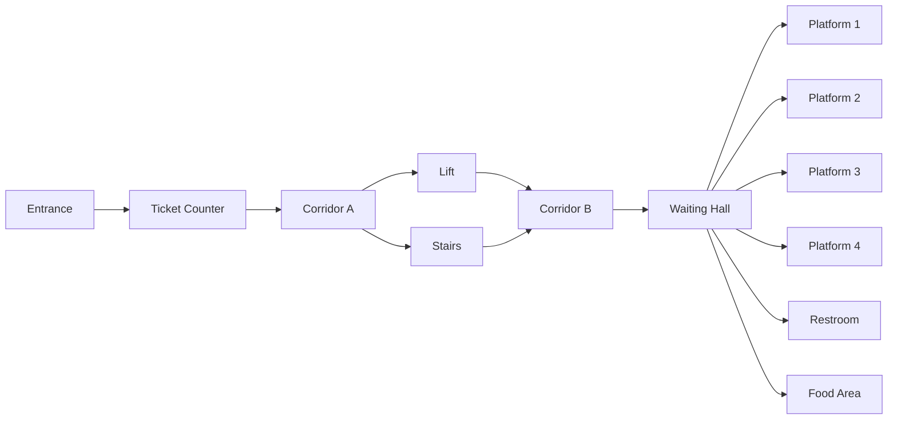

Every connection can contain additional metadata.

```text
distance
walking_time
stairs
lift
ramp
accessible
width
crowd_level
temporary_closure
```

This allows the routing engine to make decisions based on the passenger's requirements.

---

# 🧠 Intelligent Routing Engine

StationNav can use **Dijkstra's Algorithm or A*** for route calculation.

The basic route cost can be represented as:

```text
Route Cost =
    Distance Cost
    + Stair Penalty
    + Accessibility Penalty
    + Congestion Penalty
    + Lift Penalty
    + Closure Penalty
```

Different passenger profiles apply different weights.

### Standard Passenger

```text
Cost = Distance + Walking Time
```

### Wheelchair Passenger

```text
Cost =
Distance
+ High Stair Penalty
+ Inaccessible Path Penalty
```

### Low-Stair Passenger

```text
Cost =
Distance
+ Stair Penalty
```

This means two passengers travelling to the same destination can receive different routes.

---

# 🔄 Real-Time Station Updates

Railway stations can change dynamically.

Examples:

* Lift breakdown
* Escalator maintenance
* Temporary corridor closure
* Platform access restriction
* Construction
* Facility relocation

Station operators can update the station graph through the Operations Console.

For example:

```text
Lift L1

Previous Status:
AVAILABLE

Updated Status:
CLOSED
```

The routing engine then avoids the unavailable connection.

The passenger can receive:

```text
⚠️ Route Changed

The lift ahead is currently unavailable.

Recalculating an accessible route...
```

---

# 🔁 Real-Time Update Architecture

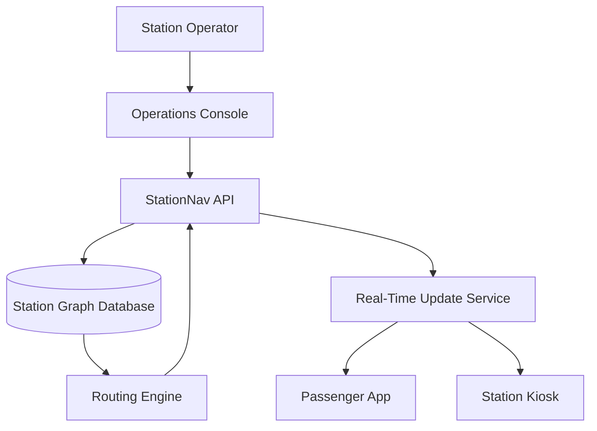

---

# 🏛️ System Architecture

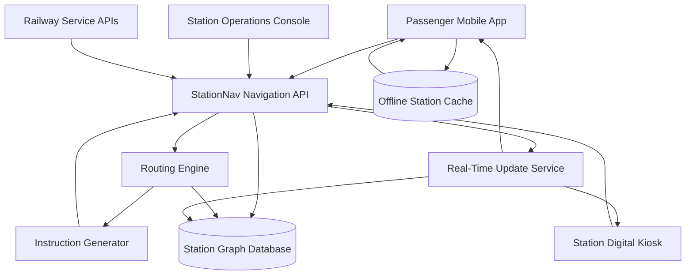

---

# 📱 Passenger Mobile Application

The mobile application provides:

* Station selection
* Facility search
* Interactive map
* Destination selection
* Accessible route selection
* Turn-by-turn navigation
* Voice guidance
* QR checkpoint scanning
* Offline map access
* Real-time route updates

### Example Passenger Flow

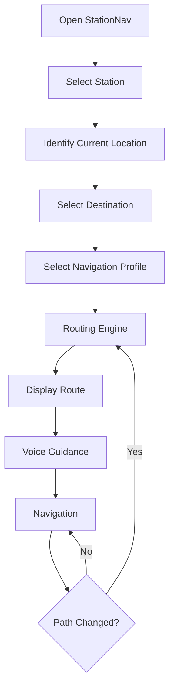

---

# 🖥️ Digital Station Kiosk

StationNav can also operate through large digital kiosks installed inside railway stations.

The kiosk can provide:

* Station map
* Facility search
* Platform navigation
* Accessible route selection
* Voice guidance
* Large touch controls
* QR code generation

### Kiosk-to-Mobile Handoff

A passenger can calculate a route on the kiosk and scan a QR code to continue the navigation on their phone.

```text
Kiosk
  ↓
Select Destination
  ↓
Calculate Route
  ↓
Generate QR
  ↓
Scan QR with Phone
  ↓
Continue Navigation
```

---

# 🔊 Voice Navigation

Voice navigation is designed to make navigation easier for visually impaired passengers and passengers who cannot continuously look at their phone.

Example:

```text
"Continue straight."

"Turn right after the ticket counter."

"Take the lift to Level 2."

"Platform 4 is approximately 40 metres ahead."
```

Instructions are generated from the navigation graph rather than being manually written for every route.

---

# 📡 Offline Navigation

Railway stations may have areas with poor connectivity.

StationNav therefore supports an offline fallback.

The application can store a signed station graph locally:

```text
Station
 ├── Map
 ├── Navigation Graph
 ├── Facilities
 ├── Accessibility Data
 └── Version Information
```

When connectivity is restored, the application checks whether a newer station graph is available.

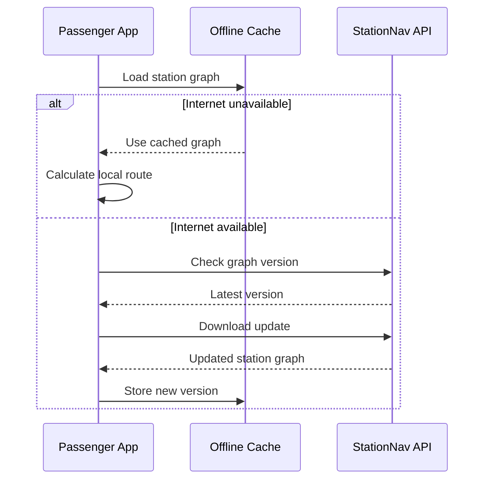

---

# 🔄 Station Map Versioning

Every station graph has a version.

Example:

```text
Station: Sample Central Station
Graph Version: 18
```

When a facility or path changes:

```text
Version 18
   ↓
Station Update
   ↓
Version 19
```

Clients can download only the necessary updates rather than repeatedly downloading the entire station map.

---

# 🧩 Core Components

## 1. Passenger Application

Responsible for:

* Search
* Maps
* Navigation
* Voice guidance
* QR scanning
* Accessibility settings
* Offline cache

---

## 2. Digital Kiosk

Responsible for:

* Public station navigation
* Large-screen map
* Facility search
* Accessible routes
* QR handoff

---

## 3. Navigation API

Provides:

```text
GET /stations
GET /stations/{id}/map
GET /stations/{id}/facilities
POST /routes
GET /graph/version
GET /updates
```

---

## 4. Routing Engine

Responsible for:

* Graph traversal
* A* / Dijkstra
* Accessibility-aware routing
* Dynamic route calculation
* Alternative routes
* Closure handling

---

## 5. Station Graph Database

Stores:

```text
Stations
Nodes
Edges
Platforms
Facilities
Accessibility Information
Map Versions
Closures
```

---

## 6. Real-Time Update Service

Responsible for:

* Temporary closures
* Facility changes
* Graph updates
* Client synchronization

---

## 7. Operations Console

Allows authorized railway personnel to:

* Add facilities
* Move facilities
* Modify paths
* Mark paths unavailable
* Update accessibility information
* Publish map updates
* Approve new graph versions

---

# 👥 Use Cases

## Use Case Diagram

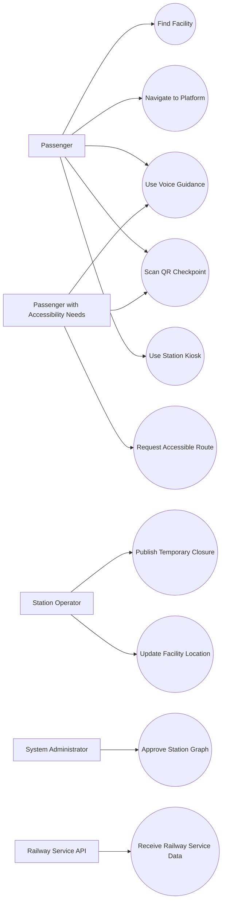

---

# 📋 Use Case Details

| ID    | Actor                   | Use Case             | Description                                  |
| ----- | ----------------------- | -------------------- | -------------------------------------------- |
| UC-01 | Passenger               | Find Facility        | Search for a station facility                |
| UC-02 | Passenger               | Navigate to Platform | Generate route to selected platform          |
| UC-03 | Accessibility Passenger | Accessible Route     | Generate wheelchair/low-stair route          |
| UC-04 | Passenger               | Voice Guidance       | Receive spoken navigation instructions       |
| UC-05 | Passenger               | QR Checkpoint        | Identify current station position            |
| UC-06 | Passenger               | Kiosk Navigation     | Navigate using a station kiosk               |
| UC-07 | Operator                | Temporary Closure    | Mark a path/facility unavailable             |
| UC-08 | Operator                | Update Facility      | Change facility information                  |
| UC-09 | Administrator           | Approve Graph        | Approve a new station graph version          |
| UC-10 | Railway API             | Service Integration  | Receive relevant railway service information |

---

# 🧑‍🦽 Accessibility Design

Accessibility is treated as a core routing requirement rather than an additional feature.

The system can store accessibility properties for every path.

Example:

```json
{
  "edge_id": "corridor_12",
  "distance": 25,
  "stairs": false,
  "ramp": true,
  "lift": false,
  "wheelchair_accessible": true,
  "temporary_closure": false
}
```

This information allows the routing engine to filter or prioritize routes.

---

# 🗣️ Voice Instruction Generation

The instruction generator converts graph paths into simple human-readable instructions.

Example:

```text
Graph Path:

Node 1 → Node 2 → Node 3 → Node 4
```

becomes:

```text
Start from Entrance A.

Walk straight towards the ticket counter.

Turn right at the waiting hall.

Continue for 40 metres.

Take the lift to Level 2.

Platform 4 is ahead.
```

---

# 🌐 Multilingual Support

The architecture is designed to support multilingual navigation.

Potential languages include:

* English
* Hindi
* Tamil
* Telugu
* Malayalam
* Kannada
* Bengali
* Marathi

The routing system remains language-independent.

The same calculated route can therefore be converted into different languages by the instruction-generation layer.

---

# 🔐 Privacy & Security

StationNav follows a privacy-first design.

The MVP does not require passengers to create an account for basic navigation.

The system can minimize collection of:

* Personal information
* Passenger identity
* Continuous location history

Administrative operations require authentication and authorization.

Station data updates can be versioned and validated before publication.

---

# 🔄 Station Data Model

A station can be represented using structured data.

Example:

```json
{
  "station_id": "DEMO-001",
  "name": "Sample Central Station",
  "version": 1,
  "nodes": [
    {
      "id": "entrance_a",
      "type": "entrance",
      "accessible": true
    },
    {
      "id": "platform_4",
      "type": "platform",
      "accessible": true
    }
  ],
  "edges": [
    {
      "from": "entrance_a",
      "to": "concourse_a",
      "distance": 40,
      "stairs": false,
      "wheelchair_accessible": true
    }
  ]
}
```

---

# 🔗 Kiosk-to-Mobile Navigation

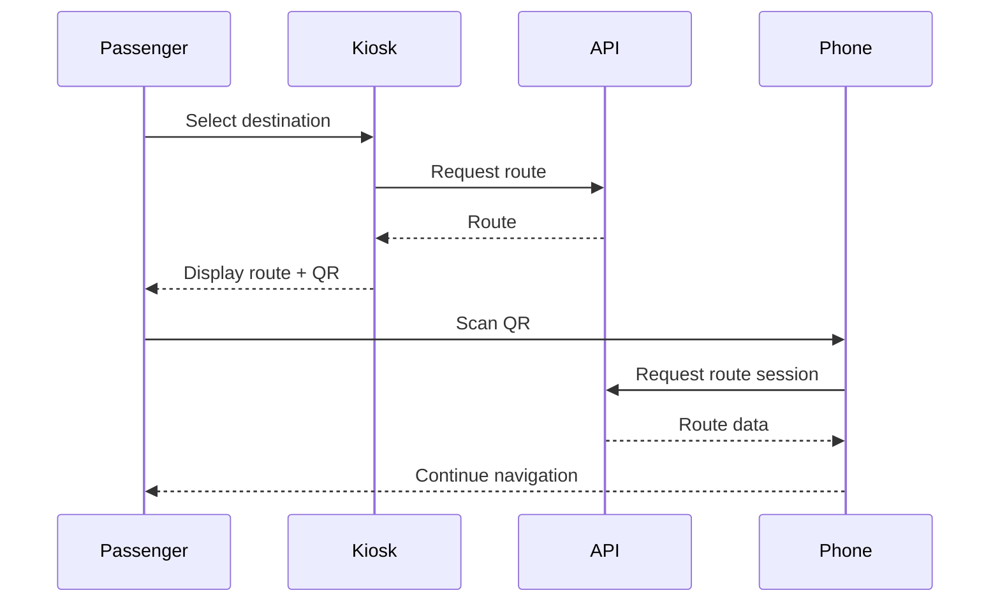

---

# 🆘 Emergency Navigation

The same graph-based architecture can be extended to emergency navigation.

Potential future use cases:

* Emergency exits
* Evacuation routes
* Blocked passage detection
* Fire/emergency access paths
* Nearest medical facility

Emergency routes can be generated dynamically based on unavailable areas.

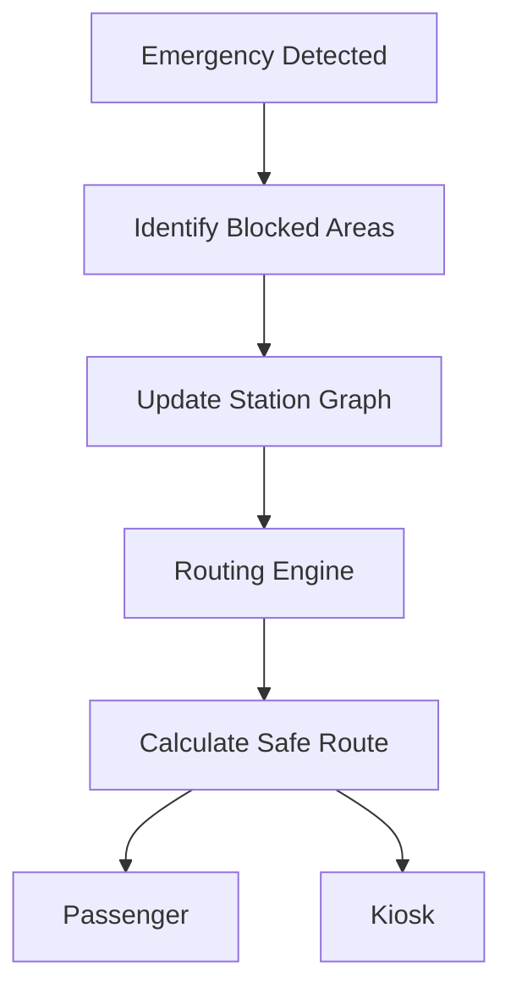

---

# 🧪 Prototype Scope

The initial prototype will use a **sample railway station model** rather than claiming to represent an actual railway station layout.

The prototype includes:

* 1 entrance
* 4 platforms
* Ticket counters
* Waiting hall
* Food area
* Restrooms
* Stairs
* Lift
* Sample corridors
* Temporary closures

The sample station layout is fictional and used only for demonstrating the navigation architecture.

---

# 🛠️ Technology Stack

| Component          | Technology                    |
| ------------------ | ----------------------------- |
| Mobile/Web UI      | React / TypeScript            |
| Mobile Application | React Native                  |
| Backend            | Python / FastAPI              |
| Routing            | A* / Dijkstra                 |
| Graph Prototype    | NetworkX                      |
| Database           | SQLite / PostgreSQL           |
| Real-Time Updates  | WebSocket / SSE               |
| Station Geometry   | GeoJSON-style structured data |
| API                | REST                          |
| Diagrams           | Mermaid                       |

---

# 📂 Proposed Repository Structure

```text
StationNav/
│
├── README.md
│
├── docs/
│   ├── ARCHITECTURE.md
│   ├── USE_CASES.md
│   └── EVALUATION.md
│
├── diagrams/
│   ├── architecture.mmd
│   ├── navigation-flow.mmd
│   ├── use-cases.mmd
│   └── station-graph.mmd
│
├── backend/
│   ├── app/
│   │   ├── main.py
│   │   ├── models.py
│   │   ├── routing.py
│   │   └── api.py
│   │
│   └── requirements.txt
│
├── frontend/
│   └── README.md
│
└── data/
    └── sample_station.json
```

---

# 🧪 Example Test Cases

| Test Case                 | Expected Result                               |
| ------------------------- | --------------------------------------------- |
| Search for Platform 4     | Platform 4 is displayed                       |
| Generate standard route   | Suitable route is generated                   |
| Generate wheelchair route | Stairs are avoided                            |
| Generate low-stair route  | Stair usage is minimized                      |
| Start voice navigation    | Spoken instructions are generated             |
| Scan QR checkpoint        | Current checkpoint is identified              |
| Close lift                | Route avoids the closed lift                  |
| Update facility           | Updated facility appears on new graph version |
| Use kiosk                 | Route is displayed on kiosk                   |
| Scan kiosk QR             | Route can be continued on mobile              |
| Disable internet          | Cached station graph remains usable           |
| Publish new graph         | Client can synchronize with newer version     |

---

# 🔬 Evaluation of Existing Submissions

The SIH requirements include evaluation of a minimum of two submissions.

The following publicly available SIH 1710 submissions were reviewed.

---

## 1. `selvasachein/SIH-1710`

Reference repository:

```text
https://github.com/selvasachein/SIH-1710
```

### Observations

The repository follows the SIH workshop/submission structure and contains sections such as:

* Idea
* Proposed Solution
* Architecture Diagram
* Use Cases
* Technology Stack
* Dependencies

### Learning Applied

StationNav expands the high-level structure into a concrete architecture containing:

* Passenger application
* Station kiosk
* Navigation API
* Routing engine
* Station graph
* Operations console
* Real-time update service
* Accessibility-aware routing

---

## 2. `jaashikakm/SIH-1710`

Reference repository:

```text
https://github.com/jaashikakm/SIH-1710
```

### Observations

The repository follows a similar SIH workshop structure containing sections for:

* Idea
* Proposed Solution
* Use Cases
* Technology Stack

### Learning Applied

StationNav separates:

```text
Passenger Experience
        ↓
Navigation API
        ↓
Routing Engine
        ↓
Station Graph
        ↓
Station Operations
```

This provides a clear separation between passenger-facing features and station management.

---

# 📚 Additional Structural Reference

## `Oviya24032K6/SIHPS`

Reference repository:

```text
https://github.com/Oviya24032K6/SIHPS
```

This repository was reviewed only for structural and presentation reference.

StationNav does **not** copy its solution, diagrams, text or implementation.

---

# 🆚 Differentiation

StationNav focuses on the combination of:

```text
Interactive Mapping
        +
Graph-Based Routing
        +
Accessibility
        +
Voice Navigation
        +
Real-Time Updates
        +
Offline Navigation
        +
Station Kiosks
        +
Railway Integration
```

The core design principle is:

> **A railway station should be treated as a living navigation graph rather than a static map.**

---

# 📈 Expected Impact

## Easier Navigation

Passengers can search for a facility instead of manually locating it.

## Improved Accessibility

Wheelchair users and passengers requiring low-stair routes can receive suitable paths.

## Better Navigation Reliability

Temporary closures can trigger automatic route recalculation.

## Inclusive Passenger Experience

Voice guidance and kiosk support provide alternative navigation methods.

## Easier Station Management

Railway staff can update station information through a centralized system.

## Scalable Architecture

The same backend architecture can support multiple stations.

---

# 🔮 Future Enhancements

## Indoor Positioning

* BLE
* UWB
* Wi-Fi positioning
* Smartphone sensor fusion

## Advanced Maps

* Full 3D station visualization
* Floor switching
* AR navigation
* Indoor landmark recognition

## Crowd-Aware Routing

Crowd density can become another route parameter.

Example:

```text
Route A
Distance: 300m
Crowd: High

Route B
Distance: 340m
Crowd: Low
```

The routing engine can use this information when generating routes.

## Multilingual Navigation

Support for more Indian languages can be added through the instruction-generation layer.

## Railway Integration

Potential integrations include:

* Train information
* Platform changes
* Station announcements
* Service alerts
* Accessibility information
* Railway mobile applications

## Analytics

The operations system can identify:

* Frequently used routes
* Congested corridors
* Facility access problems
* Navigation bottlenecks
* Accessibility gaps

---

# 🌐 Railway Integration Architecture

StationNav is designed as a navigation layer that can integrate with railway services.

Potential information sources include:

```text
Train Information
Platform Information
Station Information
Facility Information
Service Alerts
Accessibility Information
```

The integration layer keeps railway-specific APIs separate from the core routing engine.

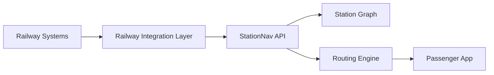

---

# 🧱 Proposed Implementation

## Phase 1 — Station Data

Create a structured station representation.

```json
{
  "station": "Sample Station",
  "version": 1,
  "nodes": [],
  "edges": [],
  "facilities": []
}
```

---

## Phase 2 — Navigation Graph

Convert station paths into graph nodes and edges.

```text
Node = Location

Edge = Walkable Connection
```

Each edge stores accessibility information.

---

## Phase 3 — Routing Engine

Implement:

```text
Dijkstra
A*
```

with profile-specific weights.

---

## Phase 4 — Passenger Interface

Implement:

* Search
* Station map
* Destination selection
* Route display
* Accessibility selection

---

## Phase 5 — Voice Navigation

Convert graph paths into human-readable instructions.

```text
Node
 ↓
Landmark
 ↓
Direction
 ↓
Distance
 ↓
Voice Instruction
```

---

## Phase 6 — QR Checkpoints

Place virtual checkpoint identifiers at important station locations.

```text
Entrance A
     ↓
Concourse 1
     ↓
Platform 4
```

---

## Phase 7 — Real-Time Updates

Implement:

* Station graph versioning
* Temporary closures
* Facility updates
* Client synchronization

---

## Phase 8 — Digital Kiosk

Create a large-screen interface using the same navigation backend.

---

# 🗺️ End-to-End System Flow

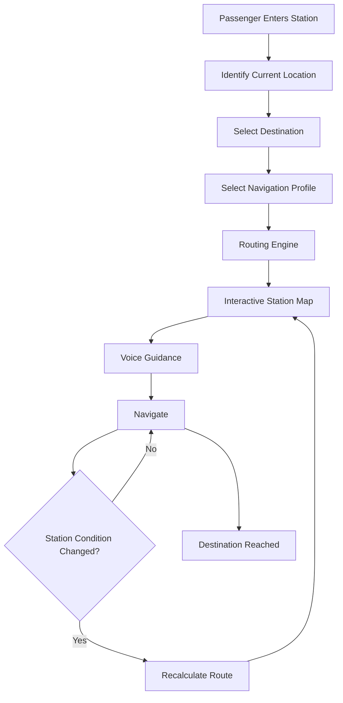

---

# 🏁 End-to-End Example

```text
Passenger enters station
        ↓
Scans Entrance A QR
        ↓
Searches "Platform 4"
        ↓
Selects "Wheelchair Accessible"
        ↓
Routing engine analyzes station graph
        ↓
Stairs excluded
        ↓
Lift prioritized
        ↓
Accessible route generated
        ↓
Map displayed
        ↓
Voice guidance begins
        ↓
Lift becomes unavailable
        ↓
Station graph updated
        ↓
Route automatically recalculated
        ↓
Passenger receives new route
        ↓
Platform 4 reached
```

---

# 🎯 Demonstration Scenario

The prototype demonstration will show:

```text
1. Open StationNav
        ↓
2. Select sample station
        ↓
3. Scan/select checkpoint
        ↓
4. Select Platform 4
        ↓
5. Select Wheelchair Route
        ↓
6. Generate accessible route
        ↓
7. Display route on map
        ↓
8. Start voice guidance
        ↓
9. Simulate lift failure
        ↓
10. Automatically recalculate route
```

---

# 🔭 Long-Term Vision

StationNav can evolve into a common indoor navigation layer for railway stations.

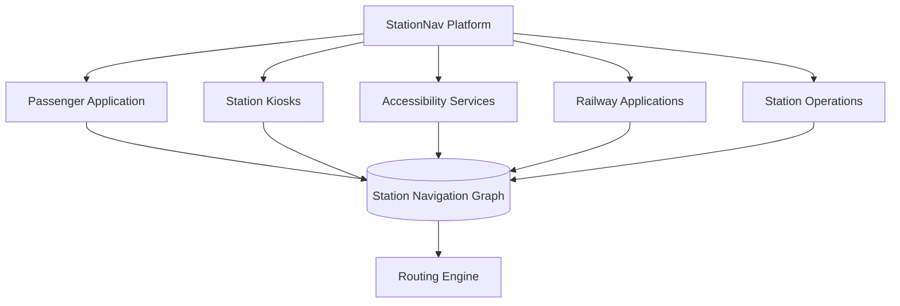

The same station data can power:

* Passenger applications
* Digital kiosks
* Accessibility systems
* Railway applications
* Station operations
* Emergency navigation

---

# ⚠️ Assumptions & Limitations

1. The prototype uses a fictional sample station layout.
2. Real railway coordinates are not assumed.
3. Real-time railway data depends on access to appropriate railway APIs.
4. BLE/UWB positioning is considered a future enhancement for the MVP.
5. Crowd-aware routing requires a suitable source of crowd information.
6. Offline navigation provides access to cached station information but cannot guarantee real-time updates while disconnected.
7. Actual deployment would require railway authority approval and validated station mapping data.

---

# 📌 Requirements Coverage

| Problem Requirement              | StationNav Feature              |
| -------------------------------- | ------------------------------- |
| Comprehensive station navigation | Interactive station map + graph |
| Facility locations               | Facility search                 |
| Detailed maps                    | Structured station map          |
| Real-time directions             | Dynamic routing                 |
| Accessibility                    | Wheelchair + low-stair routing  |
| Mobile application               | Passenger mobile application    |
| 3D interactive maps              | 3D-ready architecture           |
| Digital kiosks                   | Station kiosk interface         |
| Visually impaired passengers     | Voice-first navigation          |
| Layout updates                   | Station graph versioning        |
| Temporary changes                | Real-time closure updates       |
| Railway integration              | Railway API integration layer   |
| Offline usage                    | Local station graph cache       |
| Route recalculation              | Dynamic routing engine          |
| Station management               | Operations console              |
| Use cases                        | Use case diagram + table        |
| Proposed solution diagram        | Architecture diagram            |
| Evaluation of submissions        | Three documented references     |

---

# 📜 Originality & Compliance

This proposal was independently designed for **SIH 1710**.

The publicly available repositories listed in this README were reviewed for comparison and structural understanding.

No solution, diagram, implementation or textual content from the referenced repositories is intentionally reproduced as the StationNav solution.

The diagrams in this README are original representations of the StationNav architecture.

The sample station data is fictional and intended only for prototype demonstration.

---

# 👨‍💻 Project

## StationNav

### Smart Indoor Railway Station Navigation

```text
Navigate Better.
Navigate Accessibly.
Navigate in Real Time.
```

---

## 📌 Summary

**StationNav transforms railway stations from static maps into dynamic navigation graphs.**

```text
Passenger
    ↓
Current Location
    ↓
Destination
    ↓
Passenger Requirements
    ↓
Routing Engine
    ↓
Accessibility + Real-Time Analysis
    ↓
Optimal Available Route
    ↓
Map + Voice Navigation
    ↓
Continuous Route Updates
    ↓
Destination
```

**StationNav — Making railway stations easier and more accessible to navigate.**
